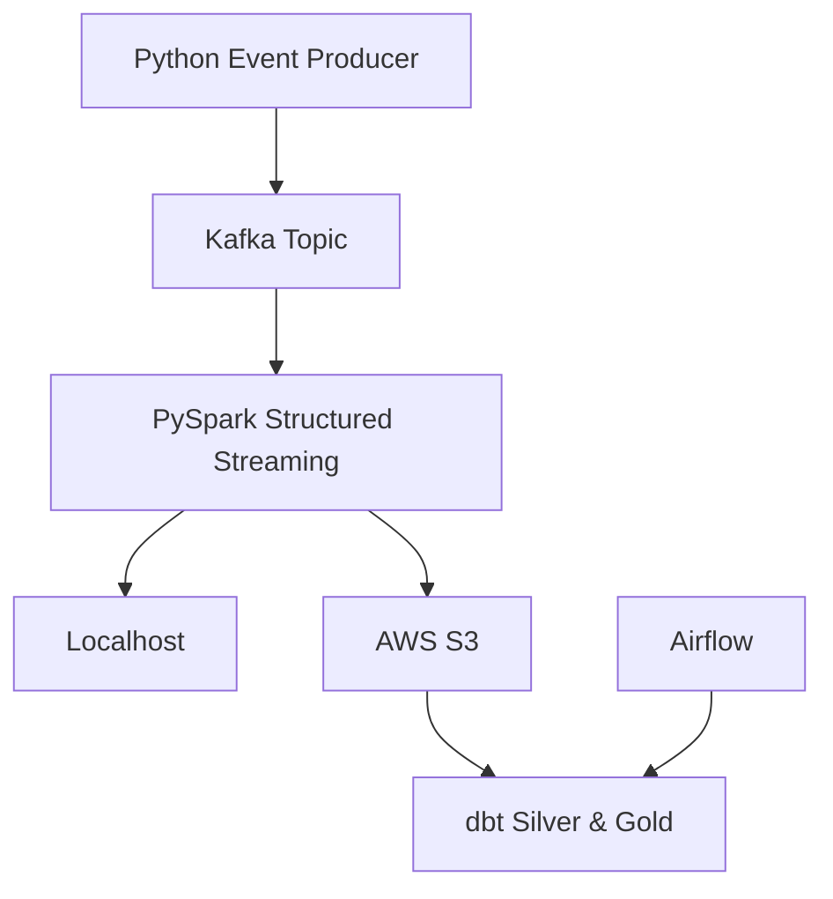

# Project Overview

Small project simulating streaming datalake pipeline built using Medalion architecture.  
```producer.py``` simulates 24/7 traffic that ```spark_consumer.py``` streams into AWS s3 storage using Iceberg table format,
all that is orchestrated by Airflow that once per day transforms stored data into silver and golden layers


## Architecture Diagram



